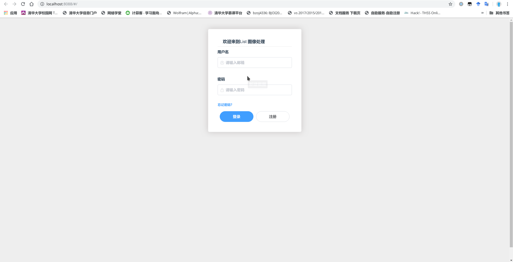
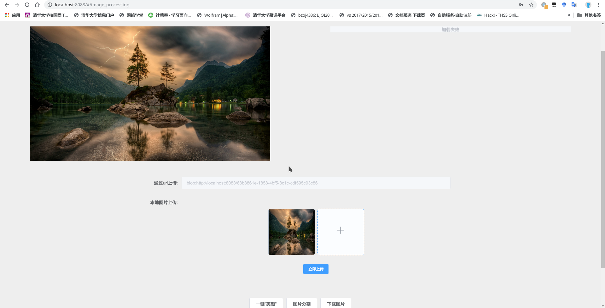
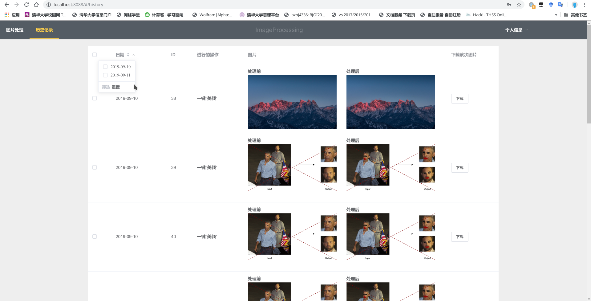
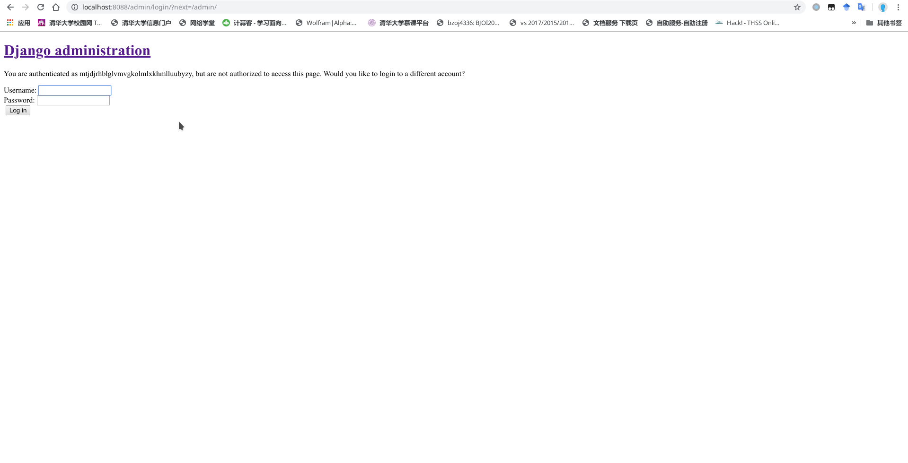

# 说明文档

## 一　运行环境及使用框架

    Ubuntu 16
    python >= 3.5
    node v12.9.1
    npm 6.11.2
    vuejs 2.0

    后端：django
    前端：element ui + vuejs

## 二　环境搭建

### 安装django

```bash
    pip install django
```

### 安装vue以及所需启动前端

```bash
    npm install --global vue-cli
```

### 安装mysql
    安装 mysql 密码设置为123456(或者修改ImageProcess/config.py 中的密码)
```bash
mysql -uroot -p
> 123456
> CREATE DATABASE ImageProcessDatabase CHARACTER SET utf8;
```

### 安装深度学习所需要的库以及django运行所需要库

```bash
git clone https://github.com/davisking/dlib.git
cd dlib
mkdir build; cd build; cmake ..; cmake --build .
cd ..
python3 setup.py install
pip install -r requirements.txt
```
>(需要确保cmake可用)

## 使用说明
### 运行
```bash
cd ImageProcess
python manage.py makemigrations
python manage.py migrate
python manage.py runserver 8080
```
in another terminal
```bash
cd ImageProcess/frontend
npm install
npm run dev
```
>之后访问vue提供的链接即可

###　注册管理员账号
```bash
python manage.py createsuperuser
```
>之后登录http://127.0.0.1:8088/admin/即可(这里是因为vue默认运行在8088端口，可视情况改变．)

### 注意事项
>django 运行的端口必须为8080，否则需要修改vue的配置文件
用户注册必须使用正规邮箱，且必须在该机上打开邮件，因为助教要自己配置环境，所以访问的链接为127.0.0.1:8080/，所以需在本机打开才能够注册成功．
### 实现功能

#### １．用户登录以及注册
>

#### 2. 美颜和图像分割

> 一键美颜采用的功能为face_recognition，通过识别人脸以及人脸中的各个部分，再加上一些简单的修饰可以实现简单的"美颜"（表情包）功能．
github:https://github.com/ageitgey/face_recognition
>
> 图像分割功能是通过识别出照片中的不同场景，并对其进行涂色来实现一个图像的分割功能．
https://pytorch.org/docs/stable/torchvision/models.html#semantic-segmentation


#### 历史记录

>实现了历史记录查看，批量删除，按照日期筛选，排序并分页展示的功能．


#### 管理员功能

>通过dajngo的管理员功能可以实现作业中的所有要求，创建管理员账户的方法已经在上文中提出．
